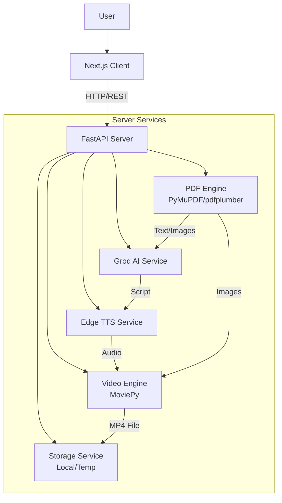
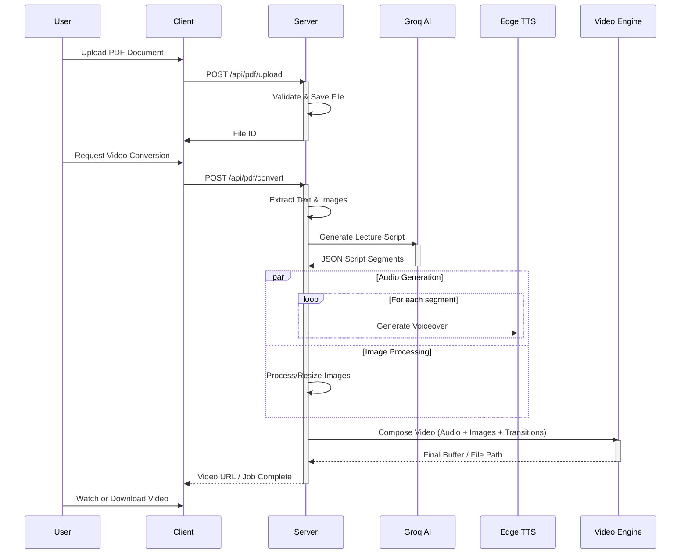

# AI Study Companion

The **AI Study Companion** is a powerful intelligent tool designed to transform static study materials into interactive and engaging learning experiences. By converting PDF documents into video lectures and providing an AI-powered chat interface, it helps users digest complex information more effectively.

## 🌟 Key Features

*   **PDF to Video Conversion**: Automatically converts PDF documents into narrated video lectures with visual aids.
*   **AI-Powered Script Generation**: Uses **Groq** (LLM) to generate engaging scripts from PDF content.
*   **Intelligent Text-to-Speech**: Utilizes **Edge TTS** for natural-sounding voiceovers.
*   **Interactive Chat**: Chat with your PDF documents to ask questions and get instant clarifications.
*   **Video Preview & Download**: Preview generated videos before downloading them for offline study.
*   **Multi-Modal Learning**: Combines text, audio, and visual elements for better retention.

---

## 🏗️ Architecture

The project consists of a **Next.js** frontend and a **FastAPI** backend, utilizing various AI and media processing services.



### PDF to Video Pipeline

The core workflow for converting a PDF to a video lecture involves several steps:



---

## 🛠️ Tech Stack

### Client (Frontend)
*   **Framework**: [Next.js](https://nextjs.org/) (React)
*   **Language**: TypeScript
*   **Styling**: Tailwind CSS
*   **Animations**: Framer Motion
*   **Video Rendering**: Remotion
*   **Icons**: Lucide React

### Server (Backend)
*   **Framework**: [FastAPI](https://fastapi.tiangolo.com/)
*   **Language**: Python 3.10+
*   **AI Model**: Groq (Llama/Mixtral)
*   **Text-to-Speech**: Edge TTS
*   **PDF Processing**: PyMuPDF, pdfplumber
*   **Video Processing**: MoviePy, FFmpeg

---

## 🚀 Getting Started

Follow these instructions to set up and run the project locally.

### Prerequisites
*   **Node.js** (v18 or higher)
*   **Python** (v3.10 or higher)
*   **FFmpeg** (Required for video processing)
    *   *Mac*: `brew install ffmpeg`
    *   *Windows*: `winget install ffmpeg`
    *   *Linux*: `sudo apt install ffmpeg`

### 1. Server Setup

Navigate to the server directory:
```bash
cd server
```

Create a virtual environment and install dependencies:
```bash
# Create venv
python -m venv venv

# Activate venv
# On Mac/Linux:
source venv/bin/activate
# On Windows:
# .\venv\Scripts\activate

# Install dependencies
pip install -r requirements.txt
```

Set up environment variables:
```bash
cp .env.example .env
# Edit .env and add your GROQ_API_KEY and other necessary keys
```

Run the server:
```bash
python -m app.main
# OR
uvicorn app.main:app --reload
```
The server will run on `http://localhost:8000`.

### 2. Client Setup

Open a new terminal and navigate to the client directory:
```bash
cd client
```

Install dependencies:
```bash
npm install
```

Run the development server:
```bash
npm run dev
```
The client will run on `http://localhost:3000`.

---

## 📚 API Documentation

Once the backend server is running, you can access the interactive API documentation at:

*   **Swagger UI**: `http://localhost:8000/docs`
*   **ReDoc**: `http://localhost:8000/redoc`

### Key Endpoints

*   `POST /api/pdf/upload`: Upload a PDF file.
*   `POST /api/pdf/extract`: Extract text and metadata from a PDF.
*   `POST /api/pdf/convert-to-video`: Initiate the PDF-to-Video conversion process.
*   `GET /api/video/status/{job_id}`: Check the status of a conversion job.
