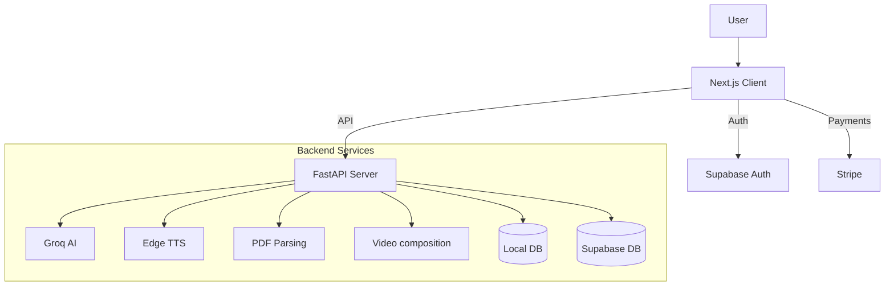

# AI Study Companion

The **AI Study Companion** is a premium, intelligent SaaS platform designed to transform static study materials into interactive and engaging learning experiences. It combines advanced AI (Groq), Text-to-Speech (Edge TTS), and video generation to help users digest complex information effectively.

## 🌟 Key Features

*   **📄 PDF to Video Conversion**: Automatically converts PDF documents into narrated video lectures with visual aids and transitions.
*   **📝 AI Summarizer**: instantly summarizes long documents with "Brief", "Standard", and "Detailed" options, complete with history persistence.
*   **💬 Interactive Chat**: Chat with your PDF documents to ask questions and get instant clarifications.
*   **💳 Subscription System**: Integrated Stripe payments for "Pro" plan upgrades, unlocking higher usage limits.
*   **📊 User Dashboard**: Track usage stats (videos created, summaries generated), view subscription status, and manage account settings.
*   **🎨 Premium UI**: A modern, responsive interface using Next.js, Tailwind CSS, and Framer Motion for a smooth user experience.

---

## 📂 Folder Structure

The project is divided into two main parts: the **Client** (Frontend) and the **Server** (Backend).

### `client/` (Next.js + TypeScript)
```
client/
├── components/         # Reusable UI components (Hero, Header, PDFUpload, etc.)
├── controllers/        # Frontend logic & API integration (MVC pattern)
├── models/             # TypeScript interfaces and types
├── pages/              # Next.js pages (Routing)
│   ├── index.tsx       # Landing Page
│   ├── dashboard.tsx   # User Dashboard
│   ├── summarize-pdf.tsx
│   └── pdf-to-video.tsx
├── services/           # External service integrations (e.g., ToolService)
├── styles/             # Global CSS (Tailwind imports)
└── utils/              # Helper functions (Supabase client, formatters)
```

### `server/` (FastAPI + Python)
```
server/
├── app/
│   ├── api/routes/     # API Endpoints (pdf_routes, ai_routes, payment_routes)
│   ├── models/         # Pydantic models (Request/Response schemas)
│   ├── services/       # Core business logic (GroqService, PDFService, StripeService)
│   └── main.py         # App entry point & CORS config
├── data/               # Local SQLite database (for video metadata)
├── storage/            # Temp storage for uploads and generating media
└── requirements.txt    # Python dependencies
```

---

## 🛠️ Tech Stack

### Client (Frontend)
*   **Framework**: [Next.js](https://nextjs.org/) (React)
*   **Styling**: Tailwind CSS, Framer Motion
*   **State/Auth**: Supabase Auth
*   **Video**: Remotion Player

### Server (Backend)
*   **Framework**: [FastAPI](https://fastapi.tiangolo.com/)
*   **AI Engine**: Groq (Llama 3 / Mixtral)
*   **TTS**: Edge TTS
*   **Video Processing**: MoviePy, FFmpeg
*   **Database**: Supabase (Postgres) + SQLite (Local)
*   **Payments**: Stripe

---

## 🚀 Workflows & Setup

### 1. Prerequisites
*   Node.js (v18+)
*   Python (3.10+)
*   FFmpeg (Installed and added to PATH)
*   Supabase Account (for Auth & DB)
*   Groq API Key (for AI generation)
*   Stripe Account (for payments)

### 2. Environment Setup

**Server (`server/.env`)**
```env
GROQ_API_KEY=your_key_here
STRIPE_SECRET_KEY=sk_test_...
STRIPE_PUBLISHABLE_KEY=pk_test_...
SUPABASE_URL=your_supabase_url
SUPABASE_KEY=your_supabase_anon_key
DATABASE_PATH=data/videos.db
```

**Client (`client/.env.local`)**
```env
NEXT_PUBLIC_SUPABASE_URL=your_supabase_url
NEXT_PUBLIC_SUPABASE_ANON_KEY=your_supabase_anon_key
NEXT_PUBLIC_STRIPE_PUBLISHABLE_KEY=pk_test_...
```

### 3. Development Workflow

**Start the Backend:**
```bash
cd server
python -m venv venv
source venv/bin/activate  # or venv\Scripts\activate on Windows
pip install -r requirements.txt
uvicorn app.main:app --reload
```
*Server runs on `http://localhost:8000`*

**Start the Frontend:**
```bash
cd client
npm install
npm run dev
```
*Client runs on `http://localhost:3000`*

### 4. Database & Migrations

**Supabase (PostgreSQL)**
Used for User Profiles, Subscription Status, and Summary History.
*   Run the provided SQL scripts (e.g., `pdf_summaries.sql`) in your Supabase SQL Editor to create necessary tables.

**SQLite (Local)**
Used for tracking video generation jobs metadata locally.
*   The schema is managed in `server/app/services/database_service.py`. It automatically initializes `data/videos.db` on startup.

### 5. Stripe Webhook Testing
To test subscription upgrades locally:
1.  Install Stripe CLI.
2.  Run `stripe listen --forward-to localhost:8000/api/payments/webhook`.
3.  Copy the Signing Secret to your server `.env` as `STRIPE_WEBHOOK_SECRET`.
4.  Trigger a test payment in the UI.

---

## 🏗️ Architecture



## 📚 API Documentation

Once the server is running, visit:
*   **Swagger UI**: `http://localhost:8000/docs`
*   **ReDoc**: `http://localhost:8000/redoc`
